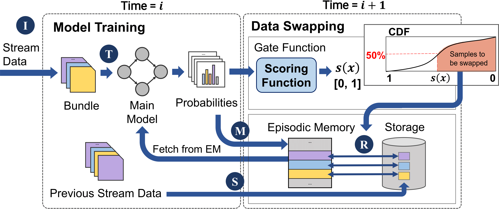

Carousel Memory(CarM) - Official Pytorch Implementation
============

#### **Official Pytorch implementation of Carousel Memory (CarM)**, accepted at **DAC 2022**




[Paper](https://dl.acm.org/doi/10.1145/3489517.3530587) | [Extended](https://arxiv.org/abs/2110.07276) | [Slide]()


Abstract
-------------
Continual Learning (CL) is an emerging machine learning paradigm in mobile or IoT devices that learns from a continuous stream of tasks. To avoid forgetting of knowledge of the previous tasks, episodic memory (EM) methods exploit a subset of the past samples while learning from new data. Despite the promising results, prior studies are mostly simulation-based and unfortunately do not promise to meet an insatiable demand for both EM capacity and system efficiency in practical system setups. We propose CarM, the first CL framework that meets the demand by a novel hierarchical EM management strategy. CarM has EM on high-speed RAMs for system efficiency and exploits the abundant storage to preserve past experiences and alleviate the forgetting by allowing CL to efficiently migrate samples between memory and storage. Extensive evaluations show that our method significantly outperforms popular CL methods while providing high training efficiency.   


Installation
-------------
Requirements for Anaconda is provided. We recommend to run CarM in conda env.   
- pytorch 1.7.1
- torchvision 0.8.2
- python 3.8.
- numpy 1.19.2
```
conda install --name carm --file requirements.yaml
```   


Test Command Line
-------------
```
python main.py --config=my/config/file/path
```
```results``` folder will be created automatically, which statistics of accuracy, losses and training time of each task are recorded.
Note that configuration files are in ```exp_config``` folder which enable to reproduce results in the original paper.   


Citation
-------------
```
@inproceedings{10.1145/3489517.3530587,
    author = {Lee, Soobee and Weerakoon, Minindu and Choi, Jonghyun and Zhang, Minjia and Wang, Di and Jeon, Myeongjae},
    title = {CarM: Hierarchical Episodic Memory for Continual Learning},
    year = {2022},
    publisher = {Association for Computing Machinery},
    url = {https://doi.org/10.1145/3489517.3530587},
    doi = {10.1145/3489517.3530587},
    booktitle = {Proceedings of the 59th ACM/IEEE Design Automation Conference}
}
```   


References
-------------
- https://github.com/aimagelab/mammoth
- https://github.com/drimpossible/GDumb
- https://github.com/arthurdouillard/incremental_learning.pytorch
- https://github.com/wuyuebupt/LargeScaleIncrementalLearning
- https://github.com/zhchuu/continual-learning-reproduce
- https://github.com/clovaai/rainbow-memory
- https://github.com/facebookresearch/agem
- https://github.com/facebookresearch/GradientEpisodicMemory
- https://github.com/srebuffi/iCaRL
- https://github.com/DRSAD/iCaRL
